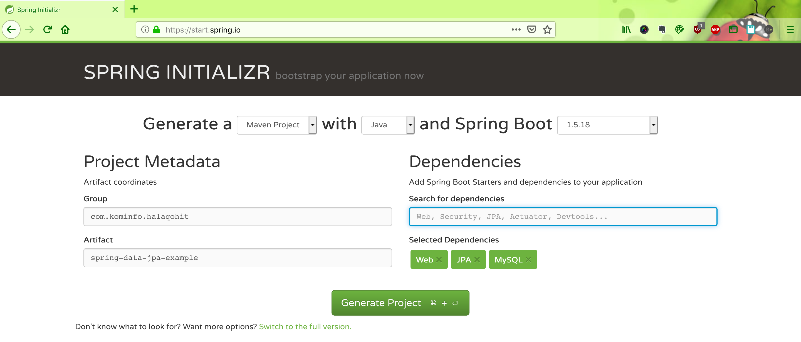
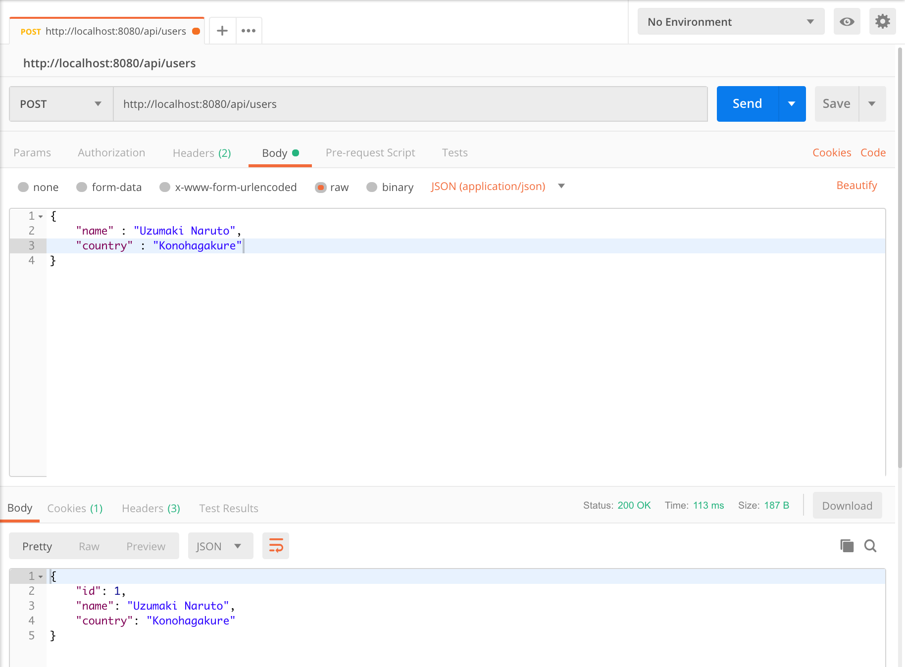
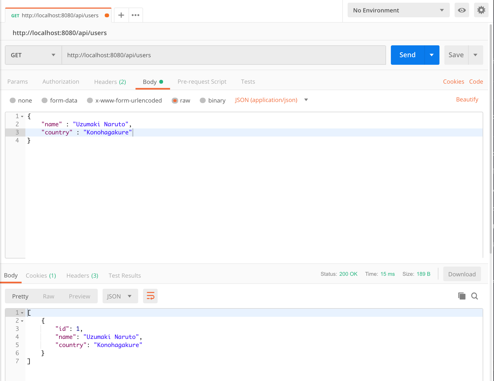
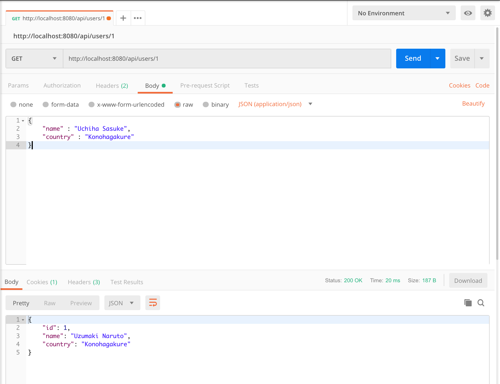
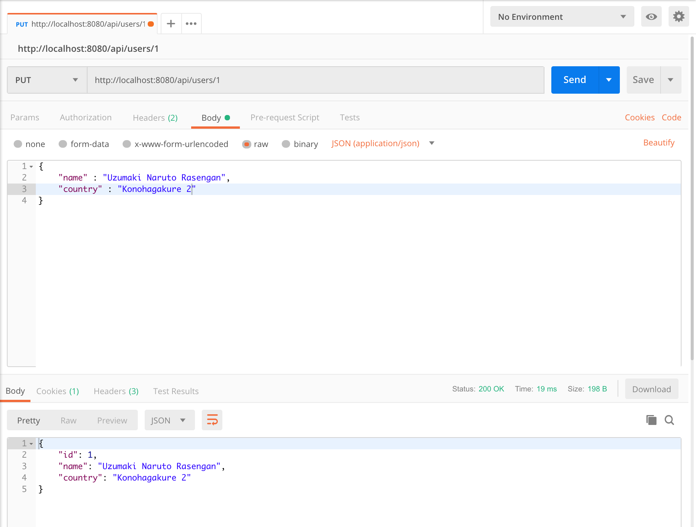
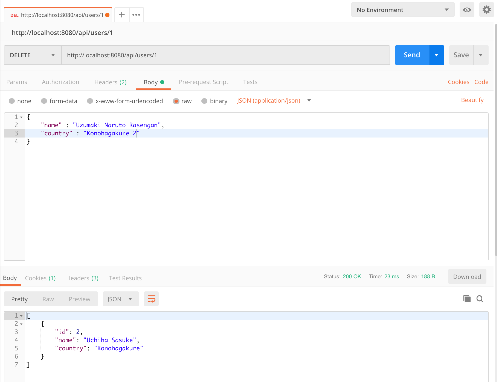

# spring-boot-data-jpa-example
Spring Boot and MySQL: Simple CRUD Application (REST API) menggunakan Spring Data JPA

Hari ini saya akan menjelaskan bagaimana cara mengembangkan **CRUD** (Create (membuat), Retrieve (mengambil), Update (memperbaharui) dan Delete (menghapus) data) sederhana.

Aplikasi yang akan kita buat adalah aplikasi web sederhana yang akan mengekpos beberapa REST API / _*endpoint*_ untuk operasi CRUD tadi.

#### Apakah Spring Data JPA itu?

Spring Data JPA adalah sub project / modul yang datang di bawah **Spring Data** project dan merupakan bagiandari keluarga Spring. Ini akan mengimplementasikan spesifikasi **JPA** (Java Persistensi API) yang mempunyai kelas dan metod untuk mengakses dan mengatur lapisan data dari sebuah aplikasi.

Seperti yang telah saya sebutkan, **Spring Data JPA** mempunyai beberapa fokus :

1. Menyediakan implementasi yang lebih baik untuk spesifikasi JPA.

2. Menghindari kerumitan yang berhubungan dengan lapisan pengaksesan Data dari sebuah aplikasi dengan menyediakan sebuah _*framework*_ yang mudah untuk diimplementasikan and mempunyai fitur yang kokoh dan handal.

OK. Cukuplah sudah teori dan basa-basinya. Mari kita eksplor dan bermain dengan spring framework. Seperti biasanya kita bisa menggunakan https://start.spring.io/ untuk membuat bootstrap/template projeknya.

Spring Initialzr



Seperti yang terlihat dalam wizard di atas, Kita menggunakan 3 dependency. Yaitu **Web**, **JPA** dan **MySQL**.

**JPA** - Mewakili maven dependency untuk Spring Data JPA.

**MySQL** - Mewakili maven dependency untuk **mysql-jdbc-connector**.

```
<dependencies>
    <!--Spring Data JPA Dependency-->
    <dependency>
        <groupId>org.springframework.boot</groupId>
        <artifactId>spring-boot-starter-data-jpa</artifactId>
    </dependency>
    <!--Spring Web Dependency-->
    <dependency>
        <groupId>org.springframework.boot</groupId>
        <artifactId>spring-boot-starter-web</artifactId>
    </dependency>
    <!--MySQL JDBC Connector -->
    <dependency>
        <groupId>mysql</groupId>
        <artifactId>mysql-connector-java</artifactId>
        <scope>runtime</scope>
    </dependency>
</dependencies>
```

#### Apa yang akan kita bangun?

Kita akan membangun operasi CRUD yang sesuai dengan kebutuhan kita yaitu objek user dan di ujungnya kita akan membuat REST API aplikasi dengan 4 endpoint untuk operasi CRUD kita.

* HTTP **POST**    /api/users   Untuk membuat User
* HTTP **GET**    /api/users   Untuk mengambil semua data User.
* HTTP **PUT**     /api/users   Memperbaharui data user.
* HTTP **DELETE**    /api/users/:user_id   Untuk menghapus data user.

#### Dimana kita memulainya?

Spring Data JPA adalah semua hal tentang cara membuat Entitas dan Repositori.

**Entitas** hidup di antara Objek Java (Kelas Java) dan tabel relasional. Itu membantu untuk memetakan objek Java terhadap tabel relasional kembali lagi ke Objek Java.

**Repository** membantu menjalankan operasi terkait CRUD dengan Entitas.

Definisi sebenarnya dari **Entitas** dan **Repositori** mungkin berbeda dari penjelasan yang saya berikan. Pada dasarnya saya hanya ingin menunjukkan dengan tepat tujuan / peran **Entitas** dan **Repositori**.

Jadi, mari kita buat Entitas dan Repositori kita.

##### Menciptakan Entitas

Kelas Entitas akan menjadi kelas berikut.

```
import javax.persistence.*;

@Entity
@Table(name = "user")
public class User {

    @Id
    @GeneratedValue(strategy = GenerationType.AUTO)
    private Long id;

    private String name;

    private String country;

    public String getCountry() {
        return country;
    }

    public void setCountry(String country) {
        this.country = country;
    }

    public Long getId() {
        return id;
    }

    public void setId(Long id) {
        this.id = id;
    }

    public String getName() {
        return name;
    }

    public void setName(String name) {
        this.name = name;
    }
}
```

**Hal-hal untuk diingat**

Hal terpenting yang harus Anda perhatikan di sini adalah bahwa kita telah menggunakan anotasi berbasis Java Persistence API (JPA) di sini.
Tidak ada penjelasan kerangka spesifik yang digunakan. Ini agar kompatibel dengan kerangka kerja ORM lain yang diterapkan / didukung JPA.
Misalnya, jika Anda telah mengembangkan lapisan data untuk memenuhi / patuh dengan spesifikasi JPA, maka akan mungkin untuk beralih dengan implementasi JPA yang berbeda dengan upaya minimal.

**Membuat Repositori**

Membuat repositori berbasis JPA sangat sederhana. Anda harus membuat **interface** yang **extends** (memperluas) interface **JpaRepository** dengan memberikan parameter generik, kelas **Entitas**, dan **tipe ID**.
Berikut adalah contoh kode untuk mengimplementasikan **UserRepository**.
```
package com.kominfo.halaqohit.springbootdatajpaexample.repository;

import com.kominfo.halaqohit.springbootdatajpaexample.entity.User;
import org.springframework.data.jpa.repository.JpaRepository;

public interface UserRepository extends JpaRepository<User, Long> {
}

```
**User** – Adalah kelas entititas

**Long** – adalah tipe data dari ID (Primary Key).

Semua metode yang diperlukan untuk operasi terkait **CRUD** akan diwarisi dari antarmuka tingkat super / induk. Karena itu kita tidak perlu menambahkan atau mengimplementasikan metode terkait **CRUD** secara eksplisit.

Sekarang kita telah membuat kelas Entitas dan Repositori. Langkah selanjutnya adalah mengkonfigurasi / memberikan rincian koneksi mysql. Ini dapat disediakan di file application.properties.
```
## Spring DATA SOURCE Configurations
spring.datasource.url=jdbc:mysql://localhost:3306/halaqohIT?createDatabaseIfNotExist=true
spring.datasource.username=root
spring.datasource.password=root

## Hibernate Properties
# The SQL dialect makes Hibernate generate better SQL for the chosen database
spring.jpa.properties.hibernate.dialect=org.hibernate.dialect.MySQL5Dialect

# Hibernate ddl auto (create, create-drop, validate, update)
spring.jpa.generate-ddl=true
spring.jpa.hibernate.ddl-auto=update
spring.jpa.show-sql=true
```

Ini akan mencoba untuk terhubung ke database "halaqohIT" yang berjalan di server mysql lokal "localhost" pada port "3306" dengan memberikan nama pengguna "root" dan kata sandi "root".
Anda harus mengubah properti ini berdasarkan detail server mysql Anda.

Sekarang kita harus mengimplementasikan **endpoint** (titik akhir) REST kita untuk membuat (Create), memperbarui (Update), menghapus (Delete) dan mendaftarkan (Retrieve) pengguna dll….
Silakan lihat **UserController** di bawah ini.

```
package com.kominfo.halaqohit.springbootdatajpaexample.controller;

import com.kominfo.halaqohit.springbootdatajpaexample.entity.User;
import com.kominfo.halaqohit.springbootdatajpaexample.repository.UserRepository;
import org.springframework.beans.factory.annotation.Autowired;
import org.springframework.web.bind.annotation.*;

import java.util.List;

@RestController
@RequestMapping("api")
public class UserController {
    @Autowired
    UserRepository userRepository;

    @PostMapping("users")
    public User create(@RequestBody User user) {
        return userRepository.save(user);
    }

    @GetMapping("users")
    public List<User> findAll() {
        return userRepository.findAll();
    }

    @GetMapping("users/{userId}")
    @ResponseBody
    public User findUserById(@PathVariable("userId") Long userId) {
        return userRepository.findOne(userId);
    }


    @PutMapping("users/{userId}")
    public User update(@PathVariable("userId") Long userId, @RequestBody User userObject) {
        User user = userRepository.findOne(userId);
        user.setName(userObject.getName());
        user.setCountry(userObject.getCountry());
        return userRepository.save(user);
    }

    @DeleteMapping("users/{userId}")
    public List<User> delete(@PathVariable("userId") Long userId) {
        userRepository.delete(userId);
        return userRepository.findAll();
    }

}
```

Membuat data User

`POST     /api/users`

Berikut postman request and response.



```
@PostMapping("/users")
public User create(@RequestBody User user)
{
  return userRepository.save(user);
}
```

**@RequestBody** - Body request (permintaan) HTTP akan dipetakan ke kelas Pengguna.

**@ResponseBody** - Objek kembalian akan dipetakan ke badan respon HTTP.

Mengambil semua data user

`GET  /api/users`



Mengambil data user tertentu

`GET  /api/users/{userId}`




Memperbaharui data user tertentu

`PUT  /api/users/{userId}`



Menghapus data user tertentu

`DELETE  /api/users/{userId}`



